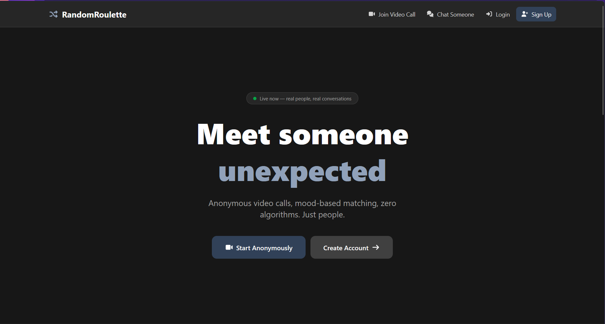
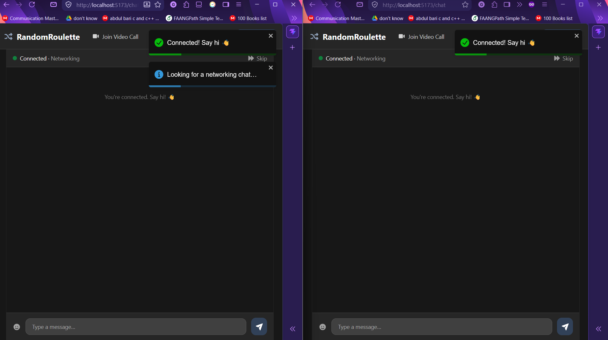

# RandomRoulette

A stranger picks up. A camera blinks on. Somewhere else in the world, someone was also just staring at a "find a match" button, also not sure who'd show up. That's the whole premise here — no profiles to swipe, no algorithm pretending it knows you, just a room, a mood, and whoever else is waiting in that same queue right now.

  
   <em>Choosing a mood is optional — leave it blank and you're matched with anyone online.</em>

## The shape of a session

You land, you optionally pick a vibe — casual chat, study, networking, or nothing at all — and the app tells you, live, how many other people are sitting in that same queue. Not a static "join now" button into a void. A number that moves.

Hit find, and the matching happens on the server the moment two compatible sockets exist: your mood's queue first, then the general pool if nobody's there yet. First match wins, room gets created, and one side becomes the WebRTC offer initiator without either of you needing to know or care which one you are.

  
   <em>Full video on the left, your own feed tucked in the corner, live chat on the right.</em>

